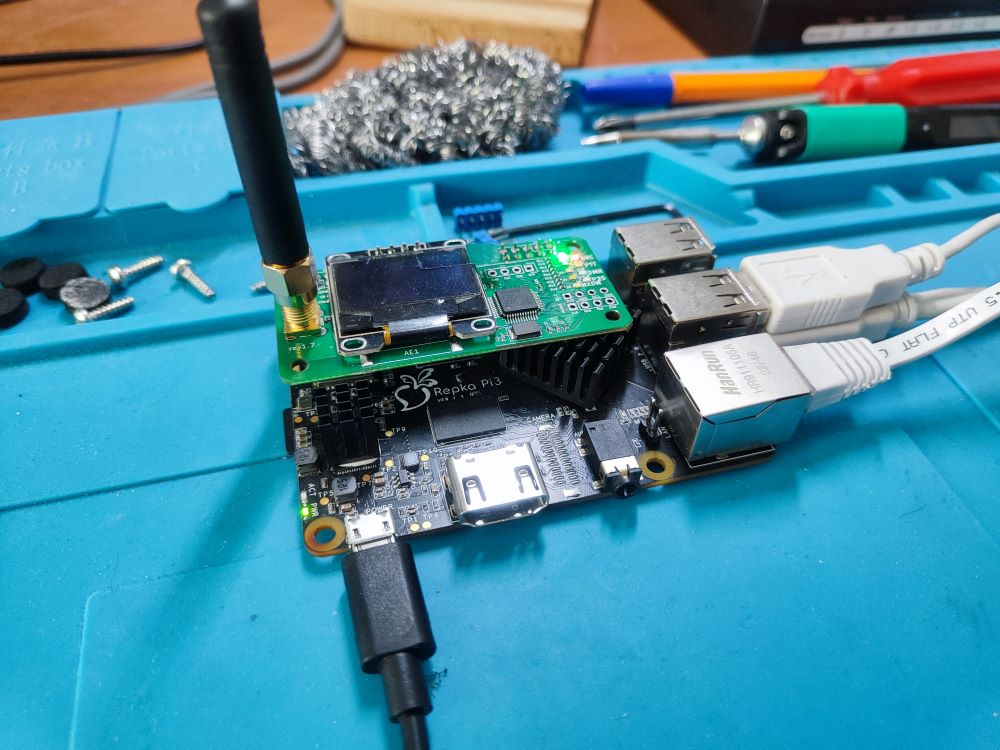
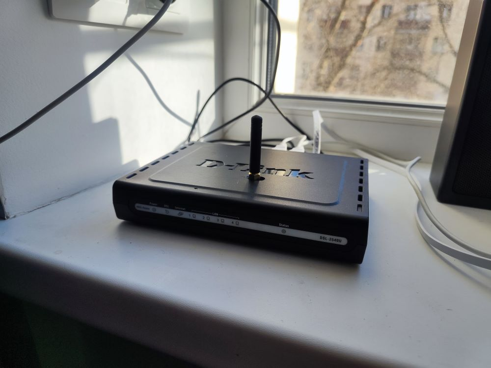

# Что в этом репозитории

DMR-хотспот на базе [MMDVMHost](https://github.com/g4klx/MMDVMHost) и [DMRGateway](https://github.com/g4klx/DMRGateway) на российском аналоге Raspberry Pi — [RepkaPi](https://repka-pi.ru/).

В репозитории:

- `Makefile` — сборка, установка и настройка сервисов одной командой.
- `mmdvmhost.cfg`, `dmrgateway.cfg` — конфиги-шаблоны с плейсхолдерами вместо личных данных.
- `oled/`, `mmdvm-display.*`, `mmdvm-info.*` — опциональный вывод статуса на OLED-дисплей шляпы (`make install OLED=1`).
- `web/` — веб-интерфейс для редактирования конфигов, просмотра логов и переключения BrandMeister/QRA-XLX без SSH.
- `bot/` — телеграм-бот с тем же переключением BrandMeister/QRA-XLX прямо из чата.
- `tasks/` — журнал решений по каждой задаче (что сломалось, почему, как починили) — читать, если что-то из описанного ниже не работает так, как ожидается.




# Железки

- MMDVM_HS_HAT c [Aliexpress](https://aliexpress.ru/item/32915442246.html?spm=a2g2w.orderdetail.0.0.48e84aa6vTCf5Q&sku_id=12000024784954883)
- [Repka Pi 3](https://repka-pi.ru/) v. 1.3 2Gb

# Инструкция

## Конфигурируем Репку

Предполагаем, что вы накатили на Репку [родную операционную систему](https://repka-pi.ru/#operation-system-anchor), она запустилась и вы получили доступ в терминал.

### Распиновка GPIO

По умолчанию распиновка у Репки отличается и выглядит [так](https://repka-pi.ru/#periphery_block), но с помощью поставляемой вместе с ОС утилиты `repka-config` её необходимо поменять. Нам нужен вариант 2.

### UART

> [!CAUTION]
> По умолчанию у Репки включен вывод на UART, что неизбежно приведёт к проблемам в работе модема (шляпы) — его необходимо отключить.

В версии `v1.0.18_d16.02.24` пункт конфигуратора называется `1 console-UART0-on/off`.

## Прошиваем модем

Возможно, модем с Алиэкспресса уже приходит прошитым — я не знал, как это проверить, и поэтому занялся прошивкой. Но проверить это можно: статья в [этом блоге](https://www.mmdvm.club/index.php/archives/249/) говорит, что **прошитый модем мигает красным светодиодом с интервалом в 1 секунду**. Похоже на правду. Или наверняка — прочитать прошивку и посмотреть, что внутри.

Для того чтобы прошить модем или прочитать его прошивку, нужно перевести его в режим прошивки по UART. Для этого необходимо в определённой последовательности переключить состояние определённых GPIO-пинов (20 и 21). `stm32flash` по идее может сделать это сама, но файлы, за которые надо дёргать GPIO у Репки, расположены в других местах — так что выхода два: хачить исходники `stm32flash` либо перемапить пины с помощью библиотеки и шить двумя командами. Я выбрал последнее.

#### Устанавливаем stm32flash

Эта штука просто есть в репозитории — качаем:

```bash
sudo apt install stm32flash
```

#### Устанавливаем библиотеку для работы с GPIO

Для совместимости с Raspberry Pi Репке нужно переключать пины программным способом. Ставим зависимости:

```bash
sudo apt update
sudo apt install python3-dev python3-setuptools git
```

Качаем [библиотеку](https://gitflic.ru/project/repka_pi/repkapigpiofs):

```bash
git clone https://gitflic.ru/project/repka_pi/repkapigpiofs.git
```

Устанавливаем:

```bash
cd repkapigpiofs
sudo python3 setup.py install
```

Далее либо пишем сами, либо запускаем [скрипт](repka-hat.py) из этого репозитория:

```bash
root@Repka-Pi:~/sources/repka-star# python3 repka-hat.py enter
Repka Pi 3
enter bootloader mode
```

Это переведёт модем в режим прошивки, и тогда можно будет посмотреть данные о нём:

```bash
root@Repka-Pi:~/sources/repka-star# stm32flash /dev/ttyS0
stm32flash 0.5

http://stm32flash.sourceforge.net/

Interface serial_posix: 57600 8E1
Version      : 0x10
Option 1     : 0x00
Option 2     : 0x00
Device ID    : 0x0410 (STM32F10xxx Medium-density)
- RAM        : 20KiB  (512b reserved by bootloader)
- Flash      : 128KiB (size first sector: 4x1024)
- Option RAM : 16b
- System RAM : 2KiB
```

Читаем прошивку в файл:

```bash
root@Repka-Pi:~/sources/repka-star# stm32flash -r dump.bin /dev/ttyS0
stm32flash 0.5

http://stm32flash.sourceforge.net/

Interface serial_posix: 57600 8E1
Version      : 0x10
Option 1     : 0x00
Option 2     : 0x00
Device ID    : 0x0410 (STM32F10xxx Medium-density)
- RAM        : 20KiB  (512b reserved by bootloader)
- Flash      : 128KiB (size first sector: 4x1024)
- Option RAM : 16b
- System RAM : 2KiB
Memory read
Read address 0x08020000 (100.00%) Done.
```

Смотрим, есть ли в ней что-нибудь про MMDVM:

```bash
root@Repka-Pi:~/sources/repka-star# strings dump.bin | grep -i mmdvm
MMDVM_HS FW configuration:
MMDVM_HS_Hat-v1.5.2 20201108 14.7456MHz ADF7021 FW by CA6JAU GitID #89daa20
```

Если да — то шить ничего не надо, если нет — то надо шить. Можно сделать тем же скриптом с командой `flash`:

```bash
python3 repka-hat.py flash
```

Он делает следующее:

1. Качает прошивку из https://github.com/juribeparada/MMDVM_HS/
2. Перетыкает GPIO-пины так же, как и `enter`, чтобы попасть в режим прошивки.
3. Запускает `stm32flash`, заливает скачанную прошивку.
4. Перетыкает GPIO-пины для выхода из режима прошивки и перезапускает модем.

## Устанавливаем хотспот

Клонируем репозиторий прямо на Репку и запускаем установку одной командой:

```bash
git clone https://github.com/r2bln/repka-star.git
cd repka-star
sudo make install
```

`make install` сам:

1. поставит зависимости (`cmake`, `g++`, `golang-go` и т.п.) — один раз, дальше идемпотентно;
2. соберёт `MMDVMHost` и `DMRGateway` из апстримных репозиториев и веб-интерфейс `repka-web` из `web/`;
3. разложит конфиги-шаблоны в `/etc/MMDVMHost` и `/etc/DMRGateway` (не трогая уже отредактированные — повторный запуск безопасен);
4. подготовит список XLX-серверов (`/etc/DMRGateway/XLXHosts.txt`);
5. засимлинкает systemd-юниты (`mmdvmhost.service`, `dmrgateway.service`, `web.service`);
6. скопирует собранные бинари в систему.

Сервисы после этого **не включаются и не стартуют сами** — сначала нужно отредактировать конфиги.

### Заполняем конфиги

В `/etc/MMDVMHost/mmdvmhost.cfg` и `/etc/DMRGateway/dmrgateway.cfg` есть плейсхолдеры вида `--callsign--`, которые нужно заменить на свои значения:

| Плейсхолдер          | Что туда вписать                                  |
|----------------------|----------------------------------------------------|
| `--callsign--`       | ваш позывной радиолюбителя                         |
| `--dmrid--`          | ваш DMR ID                                          |
| `--freq--`           | рабочая частота модема (RX/TX)                     |
| `--latitude--`       | широта хотспота                                    |
| `--longitude--`      | долгота хотспота                                   |
| `--location--`       | город/локация (для BrandMeister)                   |
| `--description--`    | описание хотспота (для BrandMeister)               |
| `--bm_password--`    | пароль от вашего BrandMeister-репитера             |
| `--xlx_password--`   | пароль для XLX-рефлектора (QRA Team, `qra-team.online`) |

Проверить, что все плейсхолдеры заполнены, можно командой:

```bash
make check-config
```

Она же автоматически прогоняется в конце `make install`.

### Запускаем сервисы

```bash
sudo systemctl enable --now mmdvmhost.service dmrgateway.service web.service
```

Проверить статус:

```bash
systemctl status mmdvmhost.service dmrgateway.service web.service
```

## OLED-дисплей (опционально)

На шляпе может стоять OLED 128x64 (SSD1306) на I2C. В актуальном MMDVMHost вывода на дисплеи больше нет — он публикует состояние в MQTT, а рисует его отдельная программа [MMDVM-Display](https://github.com/g4klx/MMDVM-Display) (IP и температуру ей поставляет [MMDVM-Info](https://github.com/g4klx/MMDVM-Info)). Схема: `mmdvmhost` → `mosquitto` → `mmdvm-display` → `/dev/i2c-N`.

Перед установкой в `repka-config` должен быть включён оверлей `i2c1`; проверить, что дисплей виден, можно так (нужен адрес `3c`):

```bash
i2cdetect -y 1
```

Ставим с ключом `OLED=1`:

```bash
sudo make install OLED=1
```

Дополнительно к обычной установке он:

1. поставит `mosquitto` (MQTT-брокер) и `i2c-tools`;
2. соберёт `MMDVM-Info` и `MMDVM-Display` вместе с библиотекой [ArduiPi_OLED](https://github.com/hallard/ArduiPi_OLED) — оригинал привязан к регистрам Raspberry Pi, поэтому её `bcm2835`-слой заменён на `oled/bcm2835.{c,h}` (то же API поверх `/dev/i2c-N`);
3. положит `mmdvm-display.ini` и `mmdvm-info.ini` в `/etc/MMDVMHost` и добавит в `mmdvmhost.cfg` секцию `[MQTT] Name=host`, если её нет (без неё MMDVMHost публикует под именем `mmdvm`, а Display слушает `host`);
4. засимлинкает юниты `mmdvm-display.service` и `mmdvm-info.service`.

Сервисы, как и остальные, сами не включаются:

```bash
sudo systemctl enable --now mosquitto mmdvm-info mmdvm-display
sudo systemctl restart mmdvmhost
```

Если экран остаётся тёмным: убедитесь, что шина в `mmdvm-display.service` (`OLED_I2C_DEV`) — та, где `i2cdetect` показывает `3c`; если картинка съехала или со шумом по краям — в `mmdvm-display.ini` смените `Type=3` (SSD1306) на `Type=6` (SH1106).

## Веб-интерфейс

После старта `web.service` на порту `8080` (`http://<адрес Репки>:8080`) доступен веб-интерфейс:

- вкладка **Конфиги** — редактирование `mmdvmhost.cfg`/`dmrgateway.cfg` через форму, перезапуск сервисов, лампочка статуса, переключатель **BrandMeister / QRA-XLX** (меняет `dmrgateway.cfg` и рестартует `dmrgateway.service`);
- вкладка **Логи** — `journalctl` по каждому сервису с автообновлением.

> [!WARNING]
> Веб-интерфейс работает без авторизации и без HTTPS, слушает на всех интерфейсах. Для доступа не только из локальной сети используйте SSH-туннель или обратный прокси с авторизацией — не выставляйте порт `8080` наружу как есть.

## Телеграм-бот (опционально)

В `bot/` лежит телеграм-бот с той же логикой переключения BrandMeister/QRA-XLX через команды `/status`, `/gobm`, `/goqra`. По умолчанию не устанавливается и не стартует — подробности и текущий статус в [`tasks/RPK-3.md`](tasks/RPK-3.md).

# Известные ограничения

- Установка рассчитана на то, что репозиторий разворачивается прямо на самой Репке (или архитектурно совместимой системе) — готового образа для SD-карты нет.
- Для человека, который не читал `tasks/`, часть шагов (заполнение плейсхолдеров, выбор частоты/DMR ID) всё ещё требует ручной работы — упрощение этого пути отслеживается в [`tasks/RPK-4.md`](tasks/RPK-4.md).
- Веб-интерфейс и бот пишут в один и тот же `dmrgateway.cfg` без блокировок — при одновременном использовании последний сохранивший побеждает.
